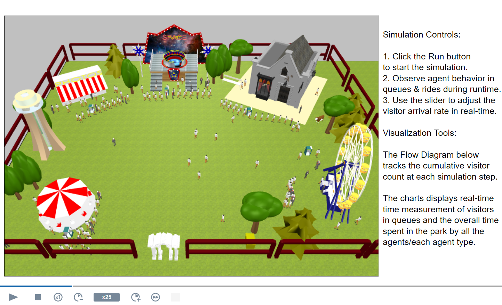
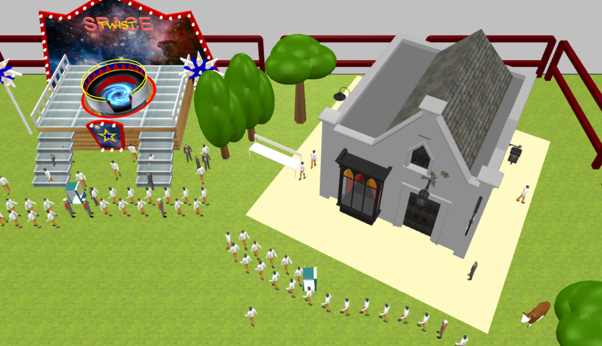
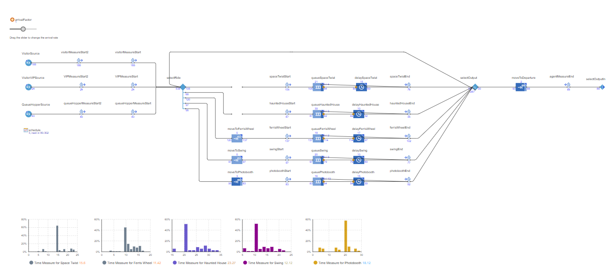

# Theme Park Queuing Simulation - A Multi Agent Based System
Agent-based modeling enables the analysis of simulating complex systems with interacting individuals. This paper demonstrates the application of agent-based modeling, using AnyLogic, to analyze visitor behavior in a theme park setting. The model captures the decision-making processes of diverse visitor types, including regular, VIP and impatient individuals, as they navigate the park’s attractions. The simulation explores the emergent dynamics of queue formation, abandonment and ride selection, seeking to observe and understand theme park operations.

---

Java

## How to Use

1. Download or clone the repository.
2. Open the model in AnyLogic PLE.
3. Click the Run button to start the simulation.
4. Observe agent behavior in queues and rides during runtime.
5. Use the slider to adjust the visitor arrival rate in real-time.
6. Observe the Flow Diagram which tracks the cumulative visitor count at each simulation step.
7. The Histograms should display real-time counts of visitors.

## Screenshots

